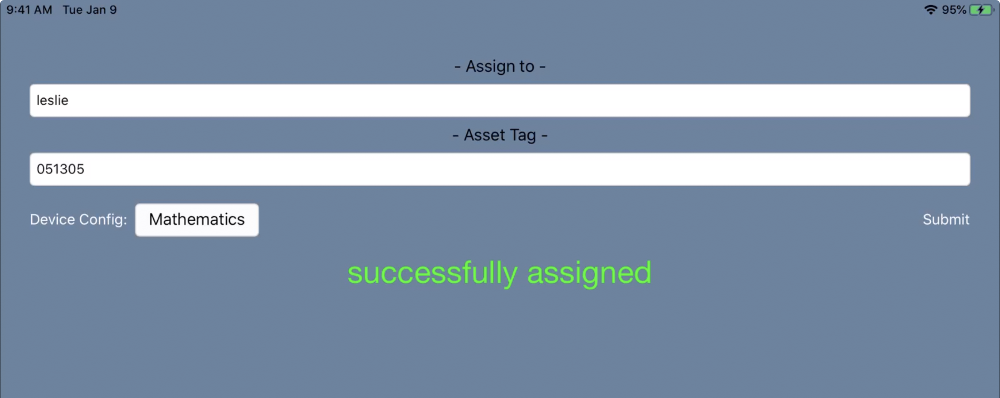

# userAssign
App used to assign a user to an iOS device and optionally add an asset tag to the device inventory.

Basic iOS app written in Swift.  The app utilizes an app configuration and user input to assign the device to a user.

Download: [userAssign](https://github.com/BIG-RAT/userAssign/releases/download/current/userAssign.ipa)


There is also the option to utilize the value of a popup extension attribute.  The following keys within the app configuration are optional, if they are not present the option to select a value from extension attribute will not be presented. Settting the eaShow key to 'yes' (without the quotes) and providing the id of the extension attribute will present the option to set the extension attribute for the device.  For example an extension attribute with an id of 19 would have the following key pair:<br/>
```
<key>eaID</key>
<string>19</string>
```
Tap the extension attribute name (Device Config in this example), located to the left and below the asset tag field, then select the value.


<br/><br/>
Once all the fields are filled out tap Submit.
<br/><br/>


You will need your own developer account to sign and distribute the app.  The following video from WWDC provides additional information:
[App Deployment](https://developer.apple.com/videos/play/wwdc2019/304/)